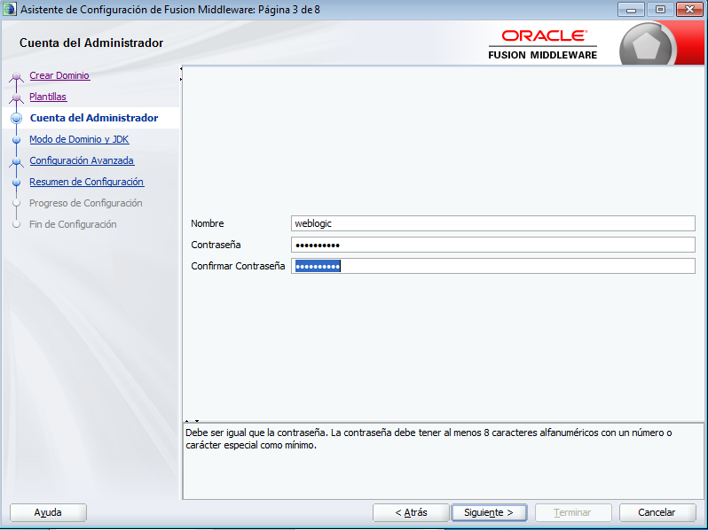
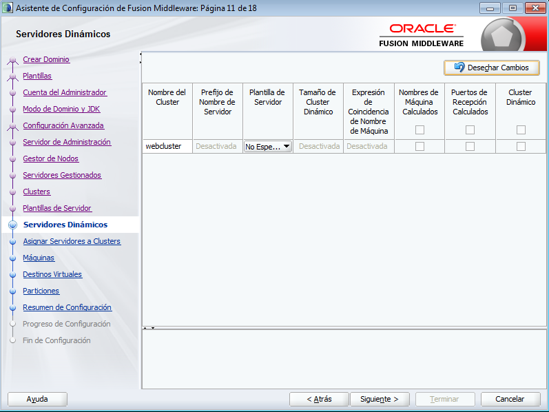
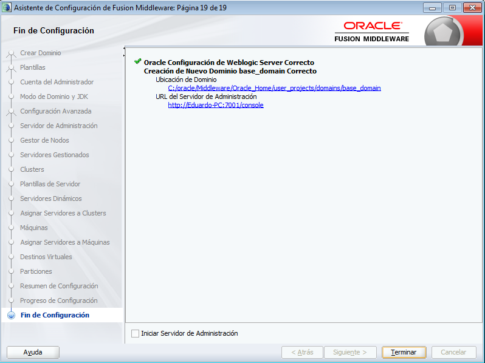

Creación de un Cluster Weblogic
========

- Requisitos:
1. Tener instalado los binarios de infraestructure o Weblogic Server.
2. Verificar que el entorno de las ventanas X esté operativo.

- Primero ejecutamos el script config.sh para proceder a crear un nuevo dominio:

.. image:: ../imagenes/componente/Captura1.PNG

- Seleccionamos crear nuevo dominio y asignamos la ruta de instalación:

- Dejamos las plantillas por defecto, que tiene "Basic Weblogic Server Domain":

- Ingresamos el usuario y contraseña para ingresar al Admin Server:

- Seleccionamos el modo en que instalaremos el dominio, en este caso Desarrollo. También seleccionamos el JDK a utilizar:

- En configuración avanzada, tildamos "Servidor de Administración", "Gestor de Nodos" y "Topología":

- Colocamos el nombre del Admin Server, la dirección ip y el puerto de recepción. En este caso lo dejamos por defecto:

- Asignamos ubicación del gestor de nodos (node manager), y credenciales del mismo:

- Agregamos la cantidad de servidores gestionados o manejados que integraran el cluster (en este caso le colocamos puertos diferentes porque estamos trabajando en la misma máquina):

- Le asignamos el nombre al cluster:

- No agregamos plantillas de servidor:

- No agregamos servidores dinámicos:

- Asignamos los servidores manejados al cluster:

.. image:: ../imagenes/cluster/Captura12.PNG

- Creamos las máquinas (machines), las cuales son máquinas lógicas asociadas a máquinas físicas. Es decir, tendremos tantas máquinas, como servidores físicos o virtuales asociados al cluster. En este caso crearemos una sola, porque estoy montando el cluster solo en mi Desktop personal. Estas son las que nos permitirán adminstrar los manejados desde el Admin Server, a través del node manager:

- Asignamos los servidores manejados a la máquina creada. El Admin Server no es necesario asignarlo, ya que no representa un manejado.

- No se Agregan Destinos Virtuales:

- No se agregan particiones:

- Nos mostrará el resumen de configuración:

- Luego esperamos que el progreso de la instalación llegue al 100 %:

- Nos indicará que el nuevo dominio fue creado:

- En caso de que se esté trabajando el cluster en varios servidores físicos o virtuales, se deberá:

1. Empaquetar el dominio en el servidor a donde fue creado:

.. image:: ../imagenes/cluster/"14-03-2019 12-44-55.png"

2. Desempaquetar el dominio en los otros servidores:

.. image:: ../imagenes/cluster/14-03-2019\ 12-47-39.png

3. Conectarse al Admin Server desde los otros servidores y enrrolar las máquinas para que puedan ser administradas:

.. image:: ../imagenes/cluster/'14-03-2019 12-49-38.png'

.. image:: ../imagenes/cluster/'14-03-2019 12-50-08.png'

- Procedemos

