Creación de Datasource en Weblogic
=========

- En la consola de Weblogic nos vamos a  Estructura de Dominio, seleccionamos Servicios ---> Orígenes de Datos, y le damos a nuevo para crear un datasource para conexión a la base de datos:

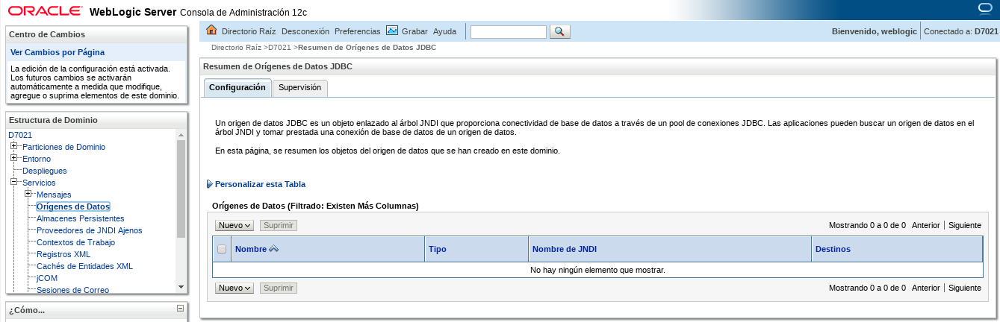

- Seleccionamos Origen de datos Genérico:

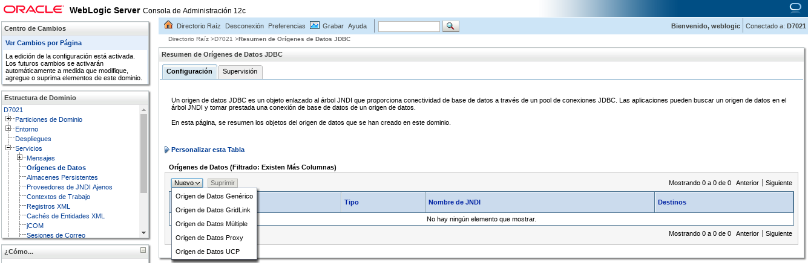

- Le asignamos el nombre al datasource:

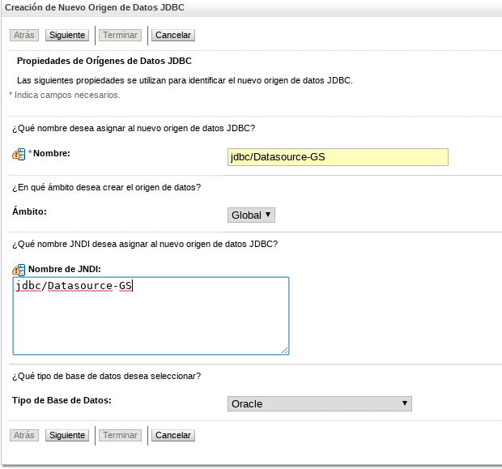

- Seleccionamos el controlador de base de datos que en nuestro caso es este:

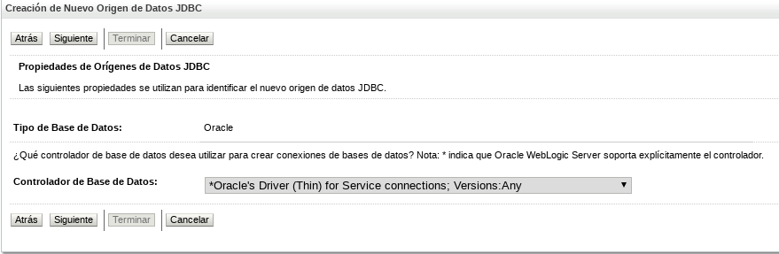

- Las opciones de transacción las dejamos por defecto:

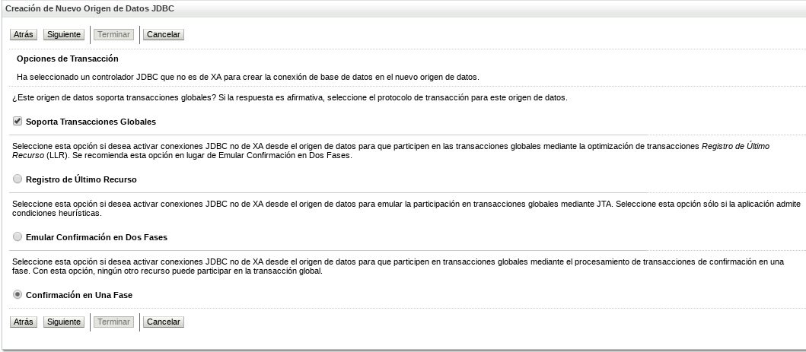

- Ingresamos el nombre de base de datos, la ip del servidor, el puerto y el usuario de base de datos con su contraseña:

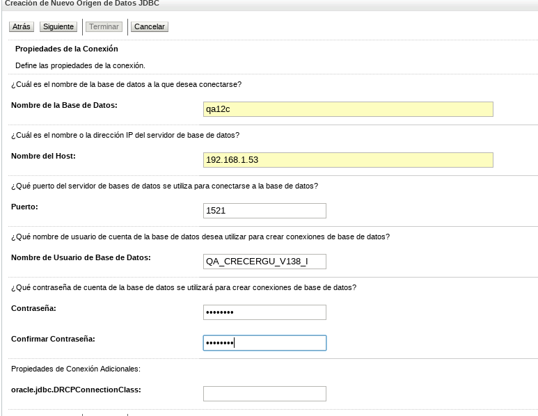

- Luego le damos a Probar Configuración, para certificar que conecte a la base de datos:

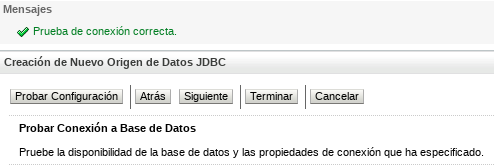

- Le damos siguiente y tildamos el dominio, y luego le damos a finalizar:

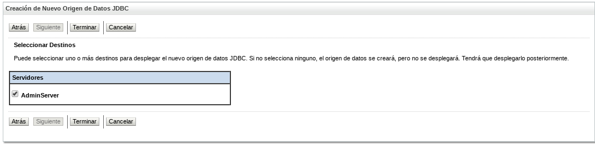

- Ya el datasource se debe haber creado de manera exitosa:

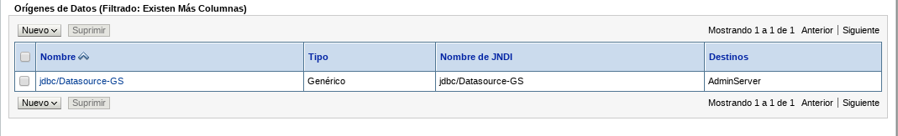

- Sí queremos aumentar el pool de conexiones posterior a la creación del datasource, lo seleccionamos y le damos a la pestaña Pool de Conexiones, y a donde dice Capacidad Máxima, colocamos el valor de nuestro gusto:

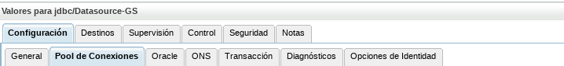

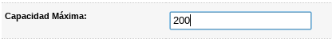

- A continuación la consola nos enviará un mensaje de que se han activado los cambios y que no es necesario reiniciar:

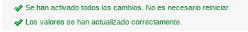

