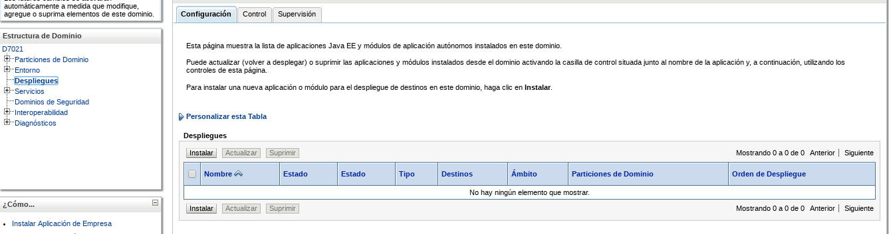
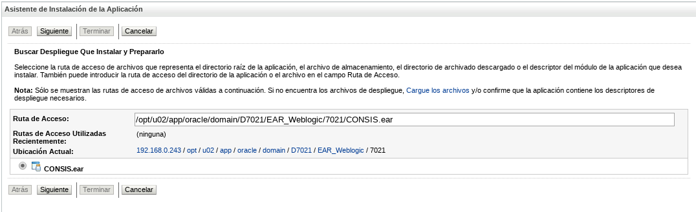
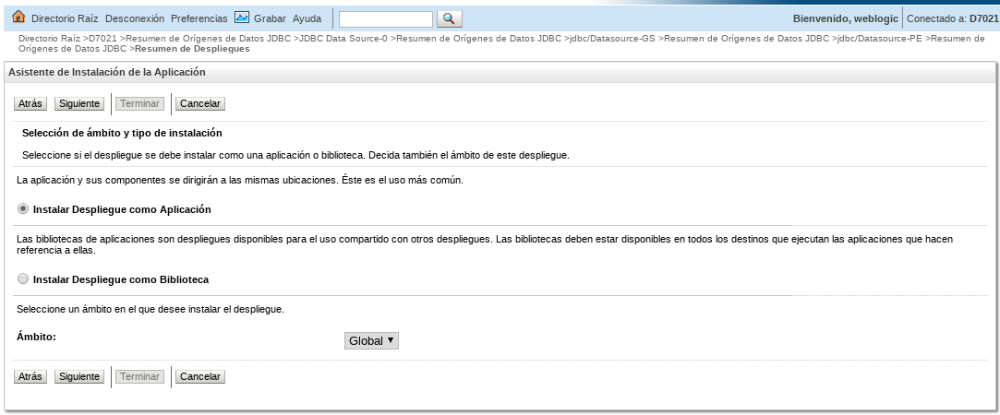
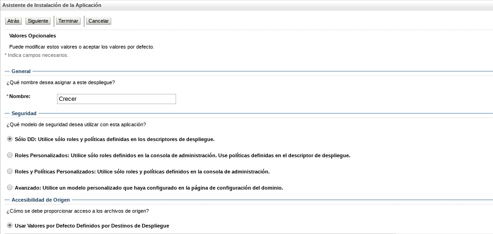
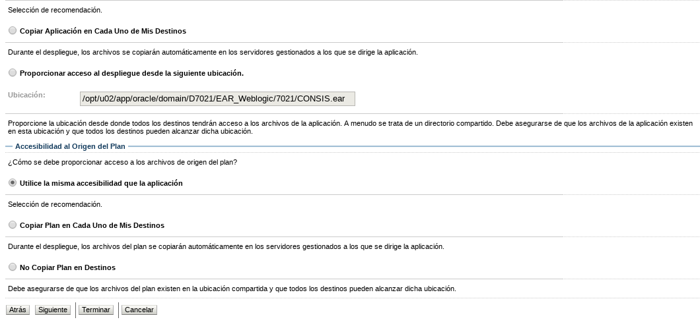
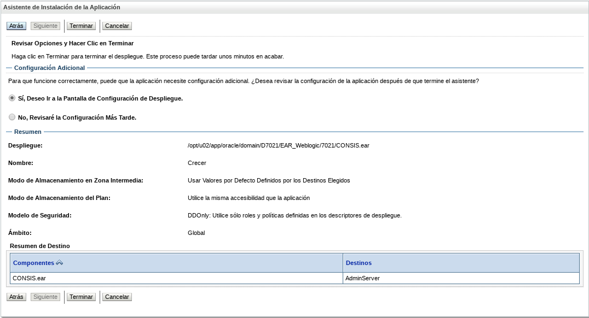
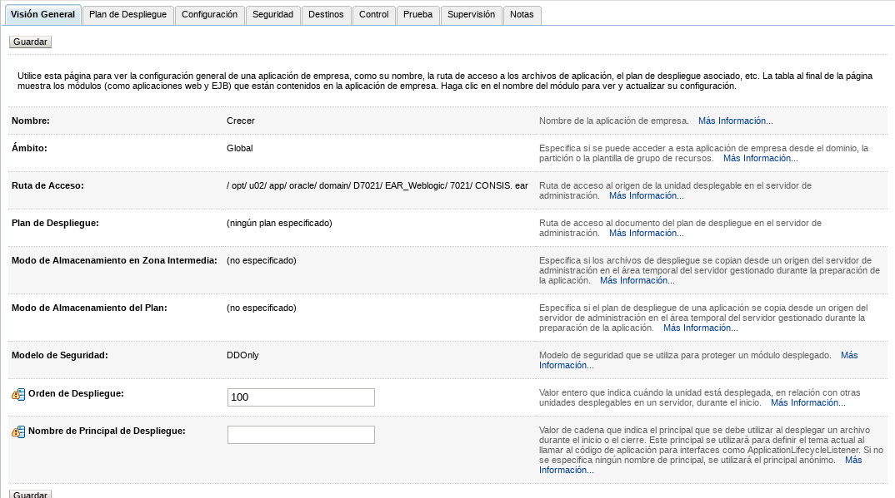
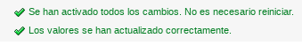

Despliegue en Weblogic.
========

- Luego de configurado el dominio podemos proceder a desplegar nuestra aplicación. Para ello, en Estructura de Dominio le damos a la opción Despliegues y seguidamente a la opción instalar:

- Le indicamos la ruta a donde esta ubicado el ear y seleccionamos siguiente:

- A continuación le damos a la opción Instalar Despliegue como Aplicación:

- Seleccionamos siguiente y le asignamos el nombre del ear:

- Siguiente para pasar al despliegue:

- Ya el despliegue se a realizado y presionamos a la opción Terminar:

- Aquí nos mostrará la Configuración General, y de estar todo bien le damos a la opción Guardar:

- Finalmente la consola nos muestra un mensaje de que se han activado todos los cambios y que no es necesario reiniciar, por lo que ya se puede proceder a consultar la aplicación:

