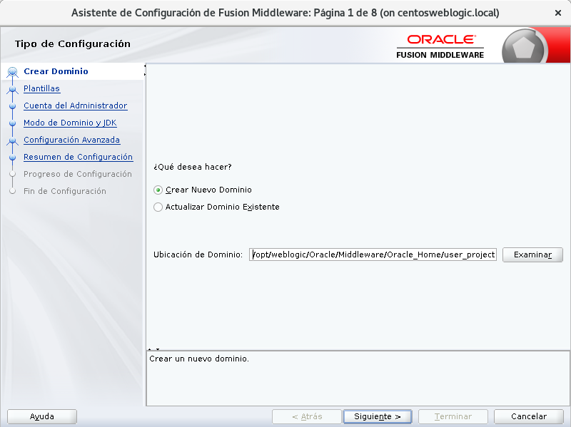
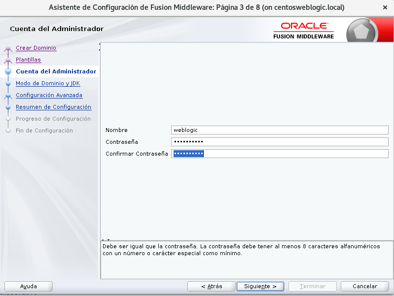
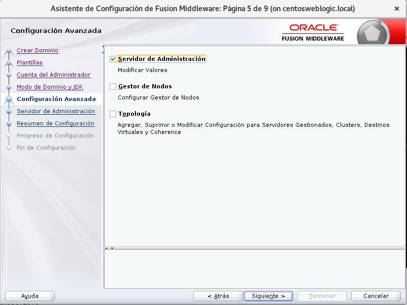
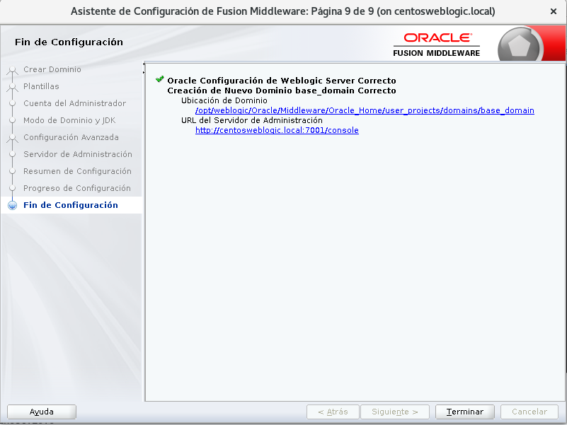
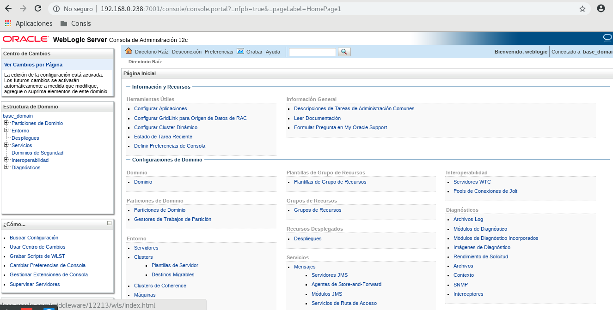

Creación de Dominio en Weblogic
========

- Luego de instalado el weblogic, nos vamos a la ruta de instalación, y buscamos el ejecutable config.sh para crear un dominio. En nuestro caso esta es la ruta::

	$cd /opt/weblogic/Oracle/Middleware/Oracle_Home/oracle_common/common/bin
	$ ./config.sh

- Seleccionamos crear un nuevo dominio y le indicamos la ruta del nuevo dominio:

- A continuación seleccionamos crear dominio mediante platilla de productos, y para nuestro caso con tildar Basic Weblogic Server Domain es suficiente:

.. image:: ../imagenes/instalacion/013.png

- Luego indicamos el usuario y contraseña para ingresar a la consola de weblogic:

- En el modo de dominio seleccionamos desarrollo, para evitar configuraciones con altos niveles de seguridad. Y seleccionamos el java JDK con que queremos instalar el dominio:

.. image:: ../imagenes/instalacion/015.png

- Seleccionamos la opción servidor de administración:

- Luego le indicamos el nombre del servidor y el puerto:

.. image:: ../imagenes/instalacion/017.png

- Nos muestra un resumen de la configuración y de estar todo bien, seleccionamos crear:

.. image:: ../imagenes/instalacion/018.png

- Espereamos que se complete la creacción al 100 %:

.. image:: ../imagenes/instalacion/019.png

- Y si nos indica que el fin de la configuración fue satisfatorio le damos a terminar:

- Luego nos vamos a la ruta de instalación del dominio al directorio bin, y primero subimos el tamaño de la máquina virtual a nuestro gusto en el archivo setDomainEnv.sh.

- Seguidamente iniciamos el dominio con el script startWebLogic.sh

- Al terminar de subir correctamente, ingresamos vía web a la consola de weblogic de la siguiente manera IP:PUERTO/console

.. image:: ../imagenes/instalacion/021.png

- Luego de loguearnos podremos observar todas las opciones para configurar el dominio:

