Instalar y crear dominio en Weblogic.
======

- Lo primero que debemos tener son los instaladores de java y weblogic a utilizar, descargados de la página oficial de Oracle, para luego proceder a descomprimirlos. Se debe tener en cuenta las versiones de java permitidas para el servidor de aplicación.

- Luego debemos definir la variable de entorno JAVA_HOME con la ruta absoluta, para trabajar de una manera mas comoda. Esto se debe hacer en el bash_profile del usuario con que vamos a trabajar, a donde exportamos la variable y la declaramos en el PATH, para cuando coloquemos la palabra java nos invoque el binario:

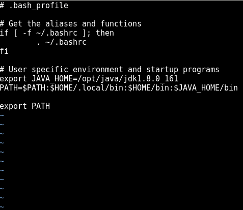

- El cambio relizado en el bash_profile se recarga con el comando source .bash_profile.

- Luego si hacemos java -version nos debe mostrar la versión::

	# java -version
	java version "1.8.0_161"
	Java(TM) SE Runtime Environment (build 1.8.0_161-b12)
	Java HotSpot(TM) 64-Bit Server VM (build 25.161-b12, mixed mode)

- Luego ejecutamos con java el jar de instalación del weblogic::

	El archivo log del iniciador es /tmp/OraInstall2018-12-10_10-03-10AM/launcher2018-12-10_10-03-10AM.log.
	Extrayendo instalador... . . . . . . . . . . . . . . . . Listo
	El usuario actual es raíz o tiene un privilegio de superusuario.
	Oracle Universal Installer no puede continuar.
	El log está ubicado aquí: /tmp/OraInstall2018-12-10_10-03-10AM/launcher2018-12-10_10-03-10AM.log.	

- En este caso nos indica que no se puede ejecutar la instalación con el superusuario por lo que debemos crear un usuario de servicio::

	# useradd weblogic
	# passwd weblogic

- Asignamos el usuario de servicio y su grupo como propietario del directorio a donde se realizará la instalación::

	# chown -R weblogic. /opt
	# ls -ld /opt/
	drwxr-xr-x. 5 weblogic weblogic 4096 dic 10 10:02 /opt/

- Nos suicheamos al usuario de servicio::

	# sudo su - weblogic

- Luego tenemos que definir variable JAVA_HOME en el .bash_history del usuario de servicio, tal cual como se explicó anteriormente.

- Luego de esto volvemos a ejecutar el jar de instalación::

	$ java -jar fmw_12.2.1.3.0_wls.jar 
	El archivo log del iniciador es /tmp/OraInstall2018-12-10_10-10-56AM/launcher2018-12-10_10-10-56AM.log.
	Extrayendo instalador... . . . . . . . . . . . . . . . . . . Listo
	Comprobando si la velocidad de CPU es superior a 300 MHz.   2993.228 MHz reales    Correcto
	Comprobando el monitor: debe estar configurado para mostrar al menos 256 colores.  No se ha definido la variable de entorno DISPLAY.    Fallo <<<<
	Comprobando el espacio de intercambio: debe ser mayor que 512 MB.   819 MB reales    Correcto
	Comprobando si esta plataforma necesita una JVM de 64 bits.   64 reales    Correcto (no son necesarios 64 bits)
	Comprobando el espacio temporal: debe ser mayor que 300 MB.   2680 MB reales    Correcto

	Fallo de algunas comprobaciones de requisitos.
	Debe cumplir estos requisitos antes de continuar.

	¿Desea continuar? (sí [s] / no [n]) [n]	

- Esta vez nos dice que no se a definido la variable de entorno display, por lo que debemos instalar los paquetes necesarios para poder trabajar con el entorno de x.

- Instalamos los 2 siguientes paquetes::

	# yum -y install xorg-x11-server-Xorg.x86_64

	# yum install xorg-x11-xauth

- Luego instamalos el paquete que contiene la aplicación xclock para vertificar el funcionamiento de las ventanas, pero como no recuerdo cual es, primero lo buscamos::

	# yum provides '*/xclock'
	Complementos cargados:fastestmirror
	Loading mirror speeds from cached hostfile
	 * base: mirror.uta.edu.ec
	 * extras: mirror.uta.edu.ec
	 * updates: mirror.uta.edu.ec
	base/7/x86_64/filelists_db      | 6.9 MB  00:00:29
	extras/7/x86_64/filelists_db    | 603 kB  00:00:02
	updates/7/x86_64/filelists_db   | 3.2 MB  00:00:15
	xorg-x11-apps-7.7-7.el7.x86_64 : X.Org X11 applications
	Repositorio        : base
	Resultado obtenido desde:
	Nombre del archivo    : /usr/bin/xclock

- Instalamos el paquete que descubrimos que tiene xclock::

	# yum install xorg-x11-apps-7.7-7.el7.x86_64

- Luego debemos desconectarnos de la sesión que tenemos y hacer la conexión ssh especificando el -X, para que se cargue la variable de entorno display. Nos debemos conectar con el usuario de servicio::

	$ ssh -X weblogic@192.168.0.239

- Ejecutamos la aplicación Xclock para probar el funcionamiento de las x::

	$ xclock

- De funcionar bien el xcloc, procedemos a ejecutar el jar nuevamente::

	
	$ java -jar fmw_12.2.1.3.0_wls.jar 
	El archivo log del iniciador es /tmp/OraInstall2018-12-10_10-20-14AM/launcher2018-12-10_10-20-14AM.log.
	Extrayendo instalador... . . . . . . . . . . . . . . . . . . . Listo
	Comprobando si la velocidad de CPU es superior a 300 MHz.   2993.228 MHz reales    Correcto
	Comprobando el monitor: debe estar configurado para mostrar al menos 256 colores.  Valor real desconocido.   Fallo <<<<
	Comprobando el espacio de intercambio: debe ser mayor que 512 MB.   819 MB reales    Correcto
	Comprobando si esta plataforma necesita una JVM de 64 bits.   64 reales    Correcto (no son necesarios 64 bits)
	Comprobando el espacio temporal: debe ser mayor que 300 MB.   1446 MB reales    Correcto

	Fallo de algunas comprobaciones de requisitos.
	Debe cumplir estos requisitos antes de continuar.

	¿Desea continuar? (sí [s] / no [n]) [n]
	y
	Ha confirmado que el producto se puede instalar en esta plataforma.
	Continuando con la instalación.

	Preparando para iniciar Oracle Universal Installer desde /tmp/OraInstall2018-12-10_10-20-14AM
	Exception in thread "main" java.lang.UnsatisfiedLinkError: /opt/java/jdk1.8.0_161/jre/lib/amd64/libawt_xawt.so: libXtst.so.6: no se puede abrir el fichero del objeto compartido: No existe el fichero o el directorio
		at java.lang.ClassLoader$NativeLibrary.load(Native Method)
		at java.lang.ClassLoader.loadLibrary0(ClassLoader.java:1941)
		at java.lang.ClassLoader.loadLibrary(ClassLoader.java:1824)
		at java.lang.Runtime.load0(Runtime.java:809)
		at java.lang.System.load(System.java:1086)
		at java.lang.ClassLoader$NativeLibrary.load(Native Method)
		at java.lang.ClassLoader.loadLibrary0(ClassLoader.java:1941)
		at java.lang.ClassLoader.loadLibrary(ClassLoader.java:1845)
		at java.lang.Runtime.loadLibrary0(Runtime.java:870)
		at java.lang.System.loadLibrary(System.java:1122)
		at java.awt.Toolkit$3.run(Toolkit.java:1636)
		at java.awt.Toolkit$3.run(Toolkit.java:1634)
		at java.security.AccessController.doPrivileged(Native Method)
		at java.awt.Toolkit.loadLibraries(Toolkit.java:1633)
		at java.awt.Toolkit.<clinit>(Toolkit.java:1670)
		at java.awt.Component.<clinit>(Component.java:593)
		at oracle.sysman.oio.oioc.OiocOneClickInstaller.main(OiocOneClickInstaller.java:643)

	Los logs están aquí: /tmp/OraInstall2018-12-10_10-20-14AM.

- Ahora nos indica que le hace falta una libreria de java por lo que procedemos a instalarsela::

	$ yum install libXtst.x86_64

- Ejecutamos el jar de instalación nuevamente y ahora si se ejecuta de manera satisfactoria::

	$ java -jar fmw_12.2.1.3.0_wls.jar 
	El archivo log del iniciador es /tmp/OraInstall2018-12-10_10-24-11AM/launcher2018-12-10_10-24-11AM.log.
	Extrayendo instalador... . . . . . . . . . . . . . . . . . . . Listo
	Comprobando si la velocidad de CPU es superior a 300 MHz.   2993.228 MHz reales    Correcto
	Comprobando el monitor: debe estar configurado para mostrar al menos 256 colores.  Valor real desconocido.   Fallo <<<<
	Comprobando el espacio de intercambio: debe ser mayor que 512 MB.   819 MB reales    Correcto
	Comprobando si esta plataforma necesita una JVM de 64 bits.   64 reales    Correcto (no son necesarios 64 bits)
	Comprobando el espacio temporal: debe ser mayor que 300 MB.   581 MB reales    Correcto

	Fallo de algunas comprobaciones de requisitos.
	Debe cumplir estos requisitos antes de continuar.

	¿Desea continuar? (sí [s] / no [n]) [n]
	y
	Ha confirmado que el producto se puede instalar en esta plataforma.
	Continuando con la instalación.

	Preparando para iniciar Oracle Universal Installer desde /tmp/OraInstall2018-12-10_10-24-11AM	

- Indicamos la ruta a donde estará el inventario de Oracle y el grupo con permisos de escritura en el directorio:

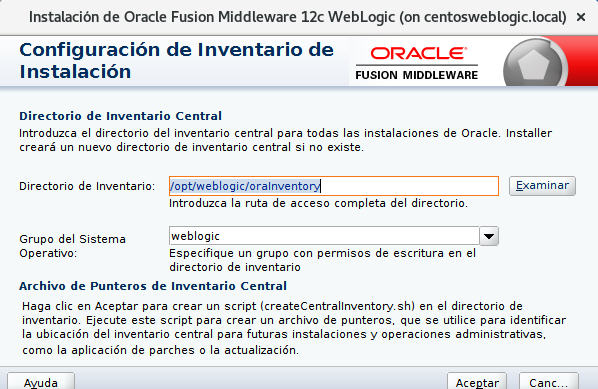

- La instalación nos da la bienvenida y le damos a siguiente.

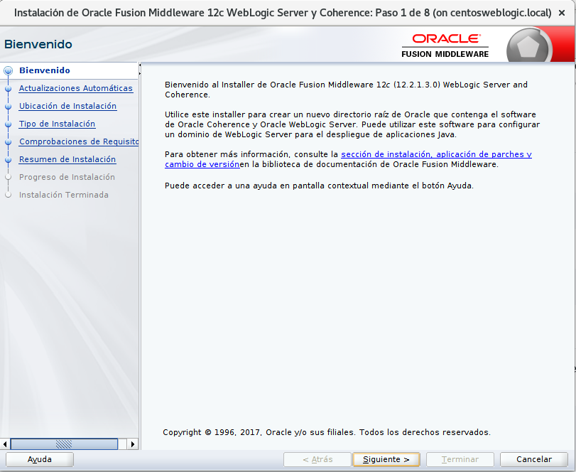

- Luego le damos a omitir actualizaciones automáticas:

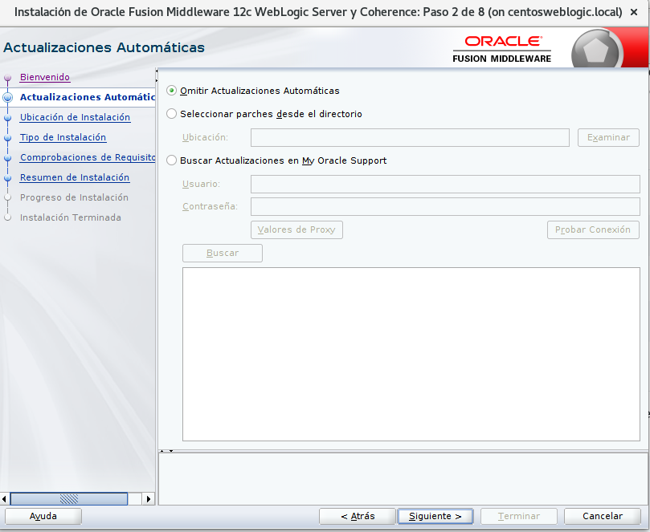

- Seleccionamos el directorio raíz de weblogic:

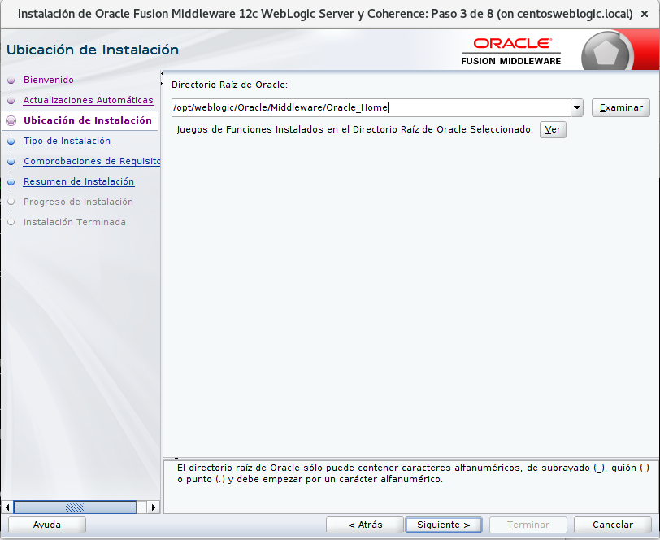

- Seleccionamos Weblogic Server:

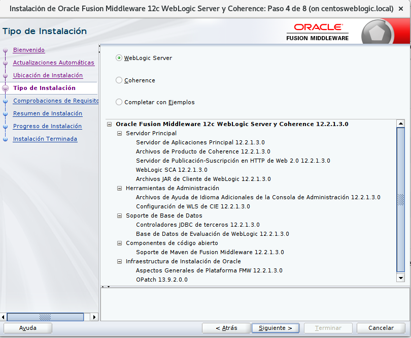

- Luego se comprueba la versión de sistema operativo y la versión de java para iniciar el instalador:

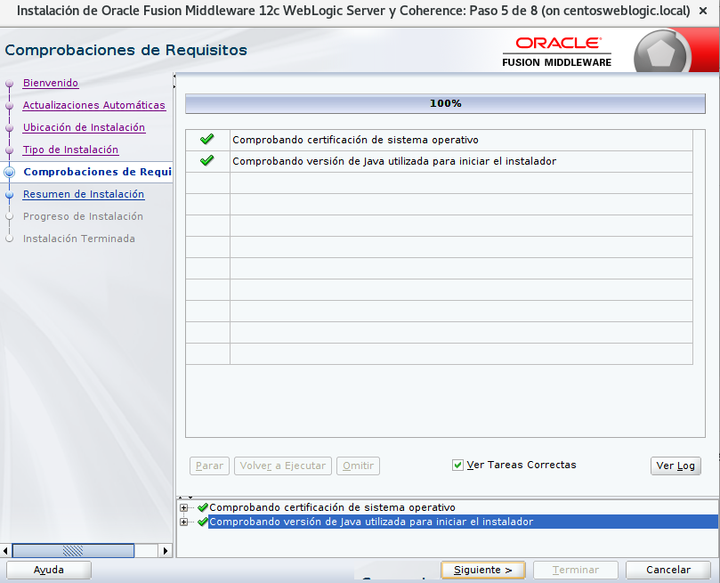

- Nos muestra un resumen de instalación, y de estar todo bien procedemos a instalar:

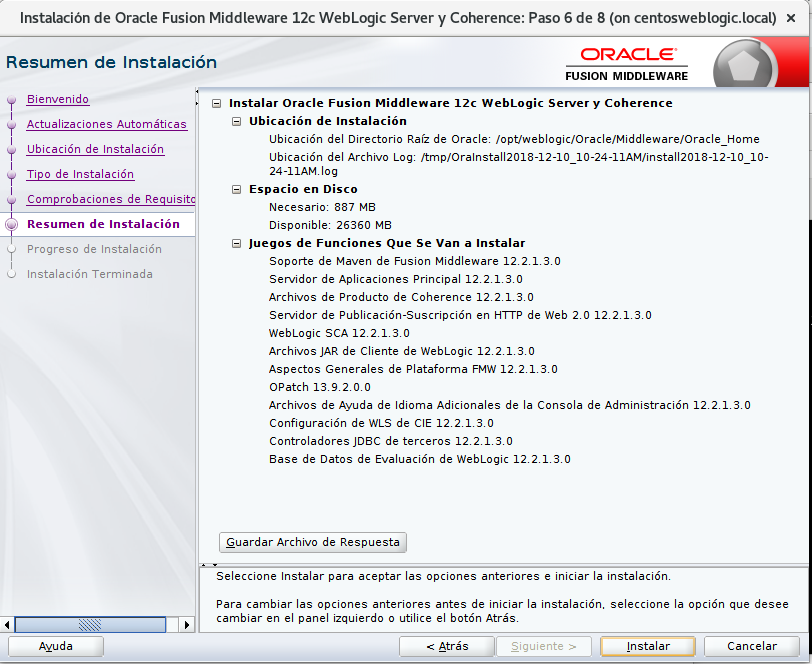

- Luego de realizada la instalación satisfactoriamente le damos a siguiente:

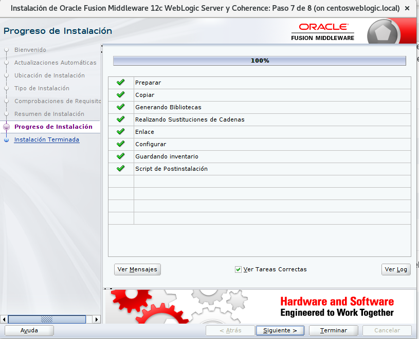

- Seguidamente nos indica que la instalación a terminado y presionamos el botón terminar:

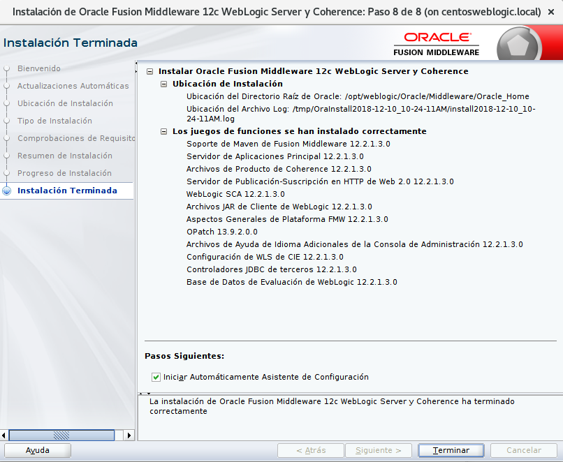

- Luego de instalado el weblogic, nos vamos a la ruta de instalación, y buscamos el ejecutable config.sh para crear un dominio. En nuestro caso esta es la ruta::

	$cd /opt/weblogic/Oracle/Middleware/Oracle_Home/oracle_common/common/bin
	$ ./config.sh

- Seleccionamos crear un nuevo dominio y le indicamos la ruta del nuevo dominio:

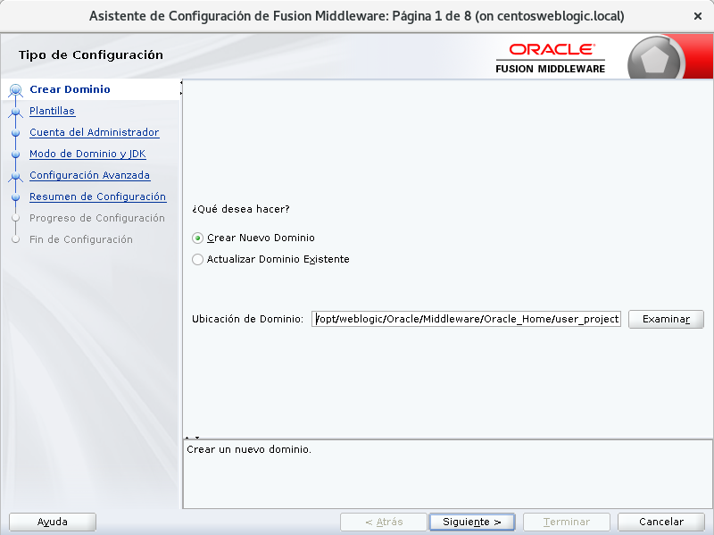

- A continuación seleccionamos crear dominio mediante platilla de productos, y para nuestro caso con tildar Basic Weblogic Server Domain es suficiente:

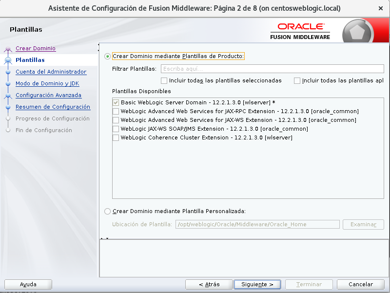

- Luego indicamos el usuario y contraseña para ingresar a la consola de weblogic:

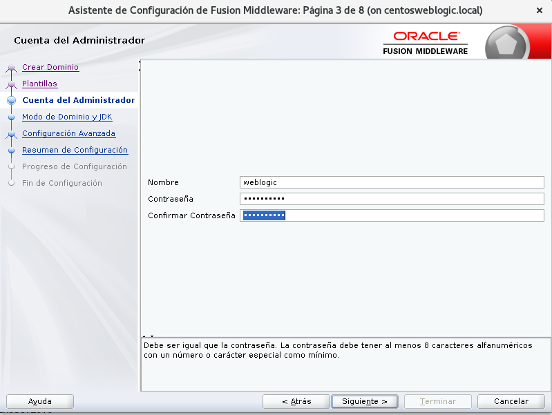

- En el modo de dominio seleccionamos desarrollo, para evitar configuraciones con altos niveles de seguridad. Y seleccionamos el java JDK con que queremos instalar el dominio:

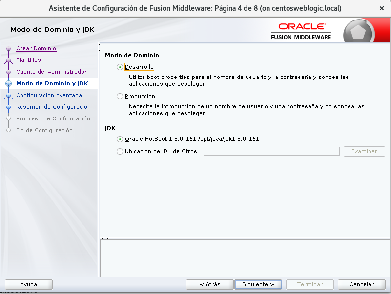

- Seleccionamos la opción servidor de administración:

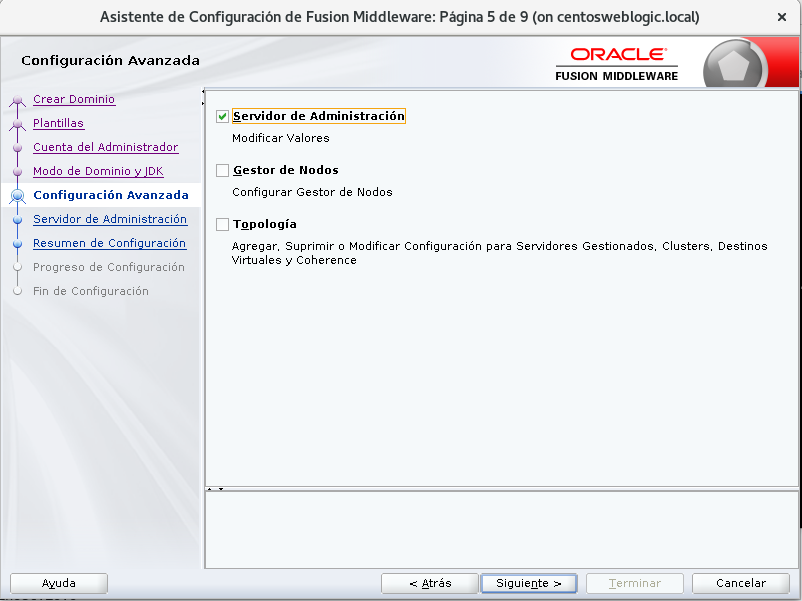

- Luego le indicamos el nombre del servidor y el puerto:

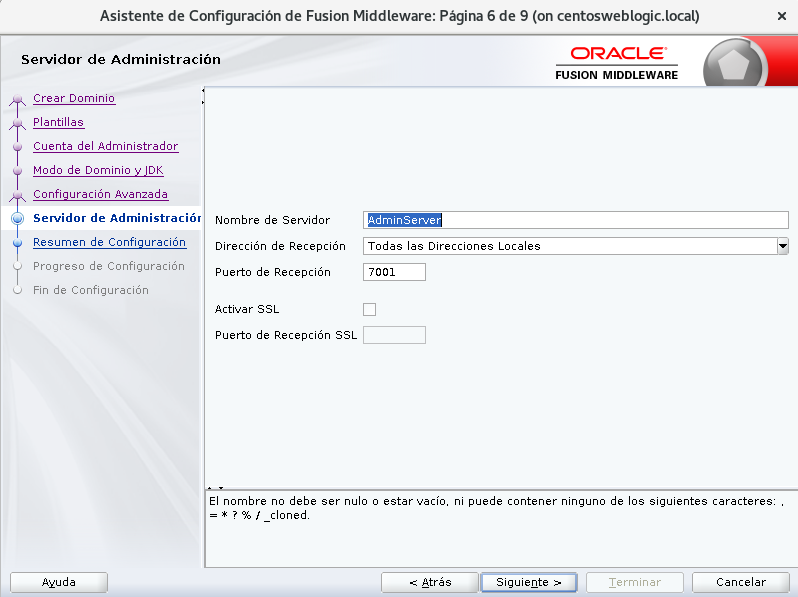

- Nos muestra un resumen de la configuración y de estar todo bien, seleccionamos crear:

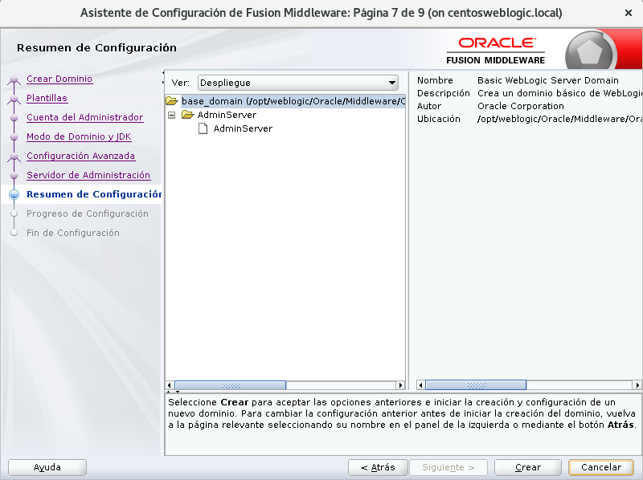

- Espereamos que se complete la creacción al 100 %:

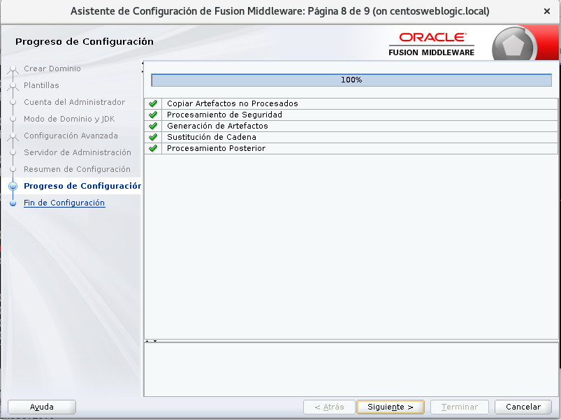

- Y si nos indica que el fin de la configuración fue satisfatorio le damos a terminar:

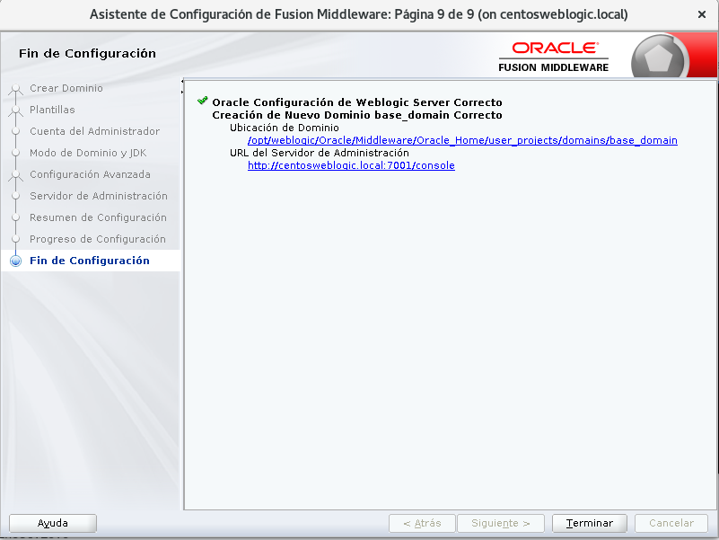

- Luego nos vamos a la ruta de instalación del dominio al directorio bin, y primero subimos el tamaño de la máquina virtual a nuestro gusto en el archivo setDomainEnv.sh.

- Seguidamente iniciamos el dominio con el script startWebLogic.sh

- Luego que termine de subir correctamente, ingresamos vía web a la consola de weblogic de la siguiente manera IP:PUERTO/console

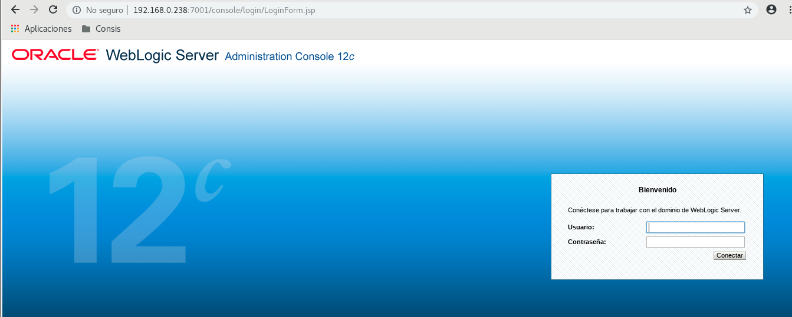

- Y al ingresar podremos observar todas las opciones para configurar el dominio:

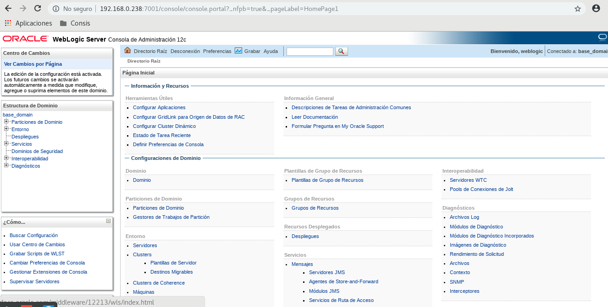

- Entre las configuraciones mas destacas estan:

 - En Estructura de Dominio, darle click al nombre de dominio, luego a la pestaña Aplicaciones 	 Web y se tilda una de las últimas opciones que se llama "Ruta de acceso Real Activada Archivada", que es para que el dominio trabaje con rutas absolutas.

 - En Estructura de Dominio, seleccionamos Servicios y luego Orígenes de Datos, y al darle nuevo podremos crear un datasource para conexión a la base de datos.

 - Sí queremos aumentar el pool de conexiones luego de creado el datasource, lo seleccionamos y le damos a la pestaña Pool de Conexiones, y a donde dice Capacidad Máxima, colocamos el valor de nuestro gusto.

