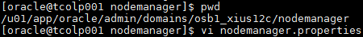
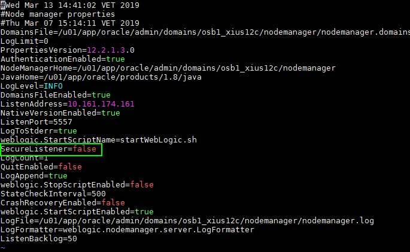

Cambio en Configuración de Seguridad del Node Manager
========

- Sí no tenemos ningún certificado asociado al puerto por el que escucha el node manager, entonces debemos modificar el archivo nodemanager.properties ubicado en la ruta $DOMAIN_HOME/nodemanager:

- El parámetro SecureListener lo debemos colocar en "false":

