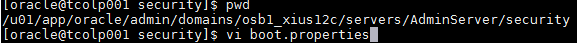
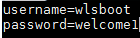
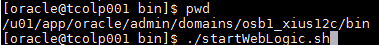

Configuración de Seguridad del Admin
========

- Para que cada vez que iniciemos el Admin no nos pida contraseña, debemos crear en la ruta $DOMAIN_HOME/servers/AdminServer un directorio llamado security, y dentro de el un archivo llamado boot.properties:

- En ese archivo debemos agregar las líneas de username y password, tal cual como lo definimos en las credenciales del Admin cuando se creó el dominio:

- Y luego al iniciar el Admin ya no nos pedirá clave y cifrará el archivo boot.properties por motivos de seguridad:

